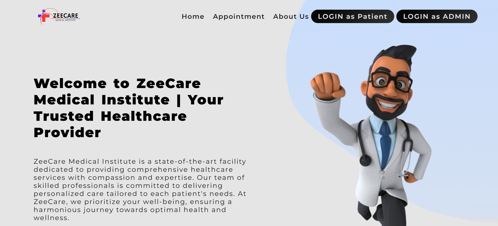
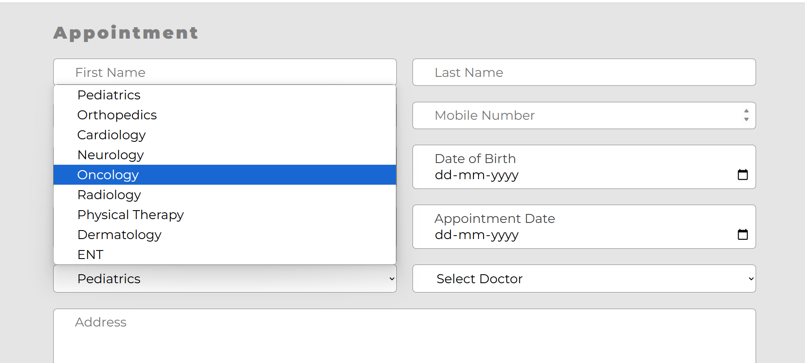
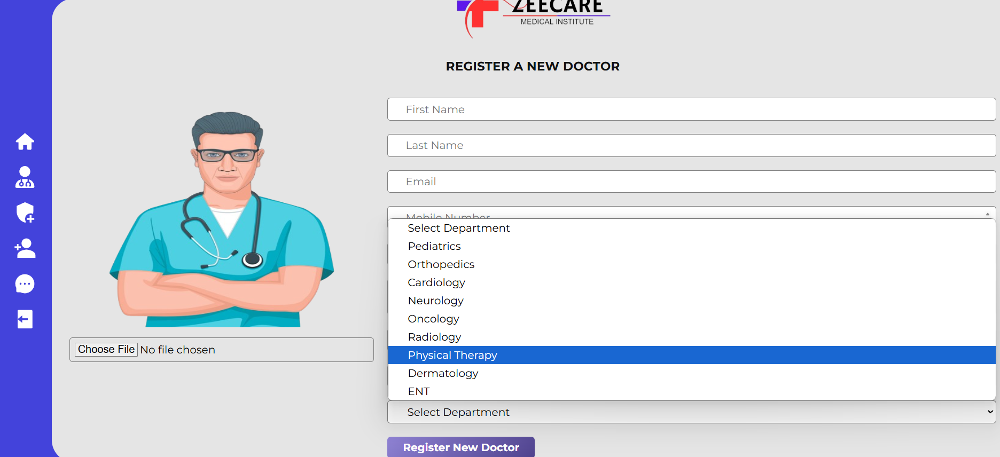
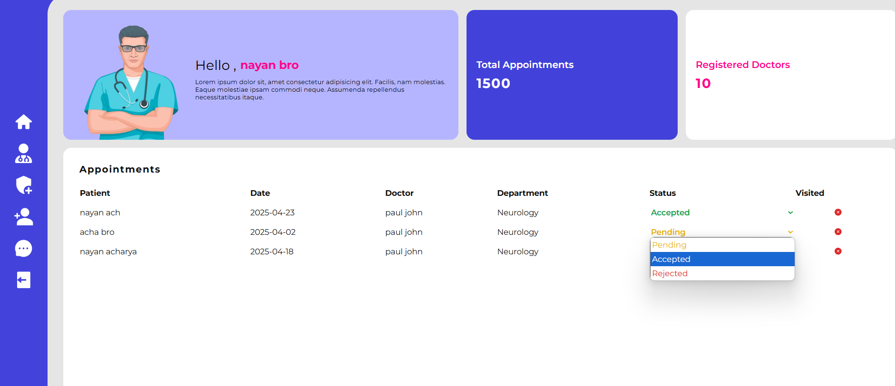

# 🏥 Hospital Appointment Booking System

🔗 **Live Demo**: [Visit the website](https://hospital-patient.onrender.com/)  

A **MERN Stack** web application that allows users to book appointments with doctors across various specializations and gives administrators full control to manage doctors and appointment requests.

---

## 📌 Project Overview

This is a full-stack hospital management platform featuring:

### 🔹 User Functionality
- View list of available doctors categorized by specialization
- Book appointments via a form-based UI
- Track appointment status (Pending / Approved / Rejected)
- Receive updates when status changes

### 🔹 Admin Functionality
- Secure login to access the admin panel
- Add, edit, or remove doctors in various medical fields
- View a list of all appointment requests
- Approve or reject appointments
- Manage the system in real-time via a centralized dashboard
- Add new admins once logged in

> **Admin Login Credentials:**  
> Email: `23bcs175@gmail.com`  
> Password: `homelander`

## ⚙️ Tech Stack

| Layer         | Tech Used |
|---------------|-----------|
| **Frontend**  | React.js|
| **Backend**   | Node.js, Express.js |
| **Database**  | MongoDB Atlas (Cloud Database) |
| **Cloud Media** | Cloudinary (for storing doctor profile images) |
| **Authentication** | JSON Web Tokens (JWT) |
| **Deployment** | Render / Vercel / (your host here) |

---

## 🖼️ Screenshots

### 🔹 Homepage — Browse Doctors by Specialization

### 🔹 Appointment Booking Page

### 🔹 Admin Panel — Doctor Management

### 🔹 Admin Panel — Appointment Requests

> Make sure to place your screenshots in a `screenshots/` folder in the root directory.

---

---

## ☁️ Cloud Integrations

### 🔸 MongoDB Atlas
Used for secure, scalable cloud-based storage of:
- Doctor profiles
- Appointment data
- Admin & user credentials

### 🔸 Cloudinary
Used to upload and manage:
- Doctor profile images
- Any future media (e.g., reports, patient documents)

---

## 🚀 Key Highlights

- Role-based access (Users vs. Admin)
- RESTful API architecture
- Modular React UI 
- Cloud-first deployment using modern stacks

